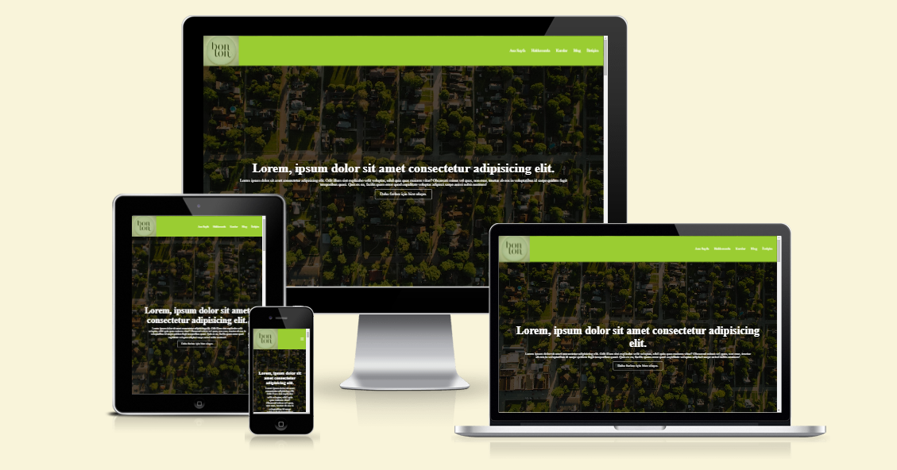

# Landing Page Project

This project showcases a landing page website created using CSS and HTML. Our goal is to design a landing page that can be used to effectively introduce a service in an impressive manner.

## `Features`

- **CSS Design:** CSS is used for the visual design of the web page.

- **User-Friendly Interface:** A simple and impactful interface allows visitors to quickly understand the content.

---

## `Technologies Used`

- **HTML:** The structure of the web page is created using HTML.

- **CSS:** CSS is used for visual styling and layout adjustments.

---

## `Deploy`

- Visit the Web Page: Open the [https://landingg-pagee.netlify.app/](https://landingg-pagee.netlify.app/) website in your browser.

---

## `Responsive Design Preview`

---

## `Screenshot`

## 
